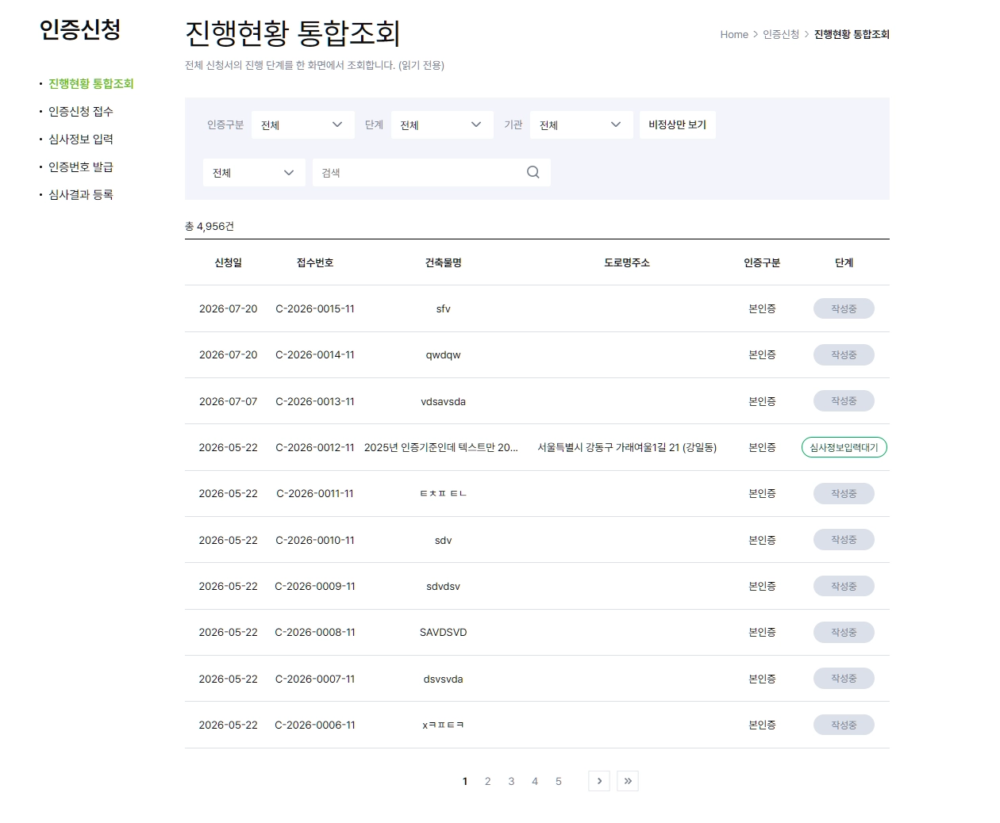
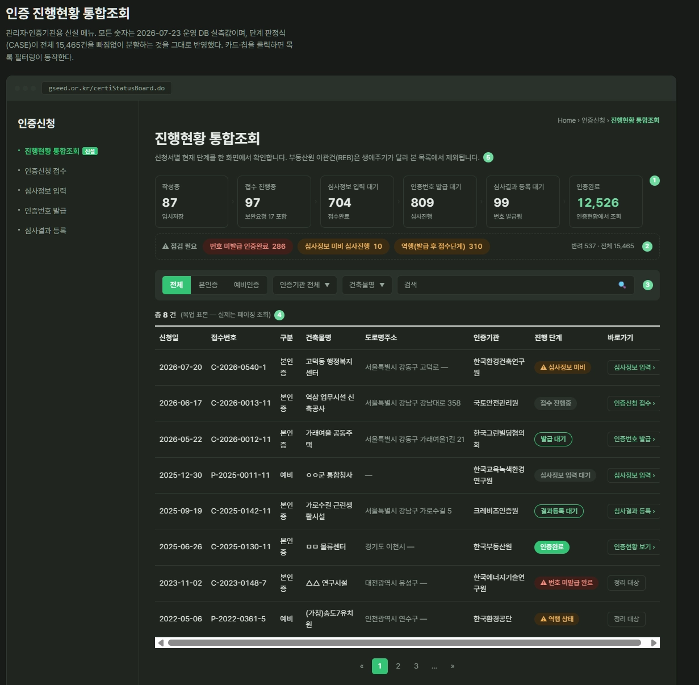

<div align="center">

# gx-design

**BX · 그래픽 · UX/UI · 영상 — Claude Code와 Codex에서 한 줄로 요청하세요.**

AI 크리에이티브 디렉터가 결정 트리가 빌 때까지 인터뷰하고,
리서치 → 전략 → 제작 → 검수 → 실물 제작 파이프라인을 역할별 절차로 진행합니다. 위임 도구가 있고 허용되면 역할을 맡기고, 없으면 주 에이전트가 같은 절차를 수행합니다.

[](https://bs-koo.github.io/gx-design/)

[빠른 시작](#빠른-시작) • [왜 gx-design인가?](#왜-gx-design인가) • [어떻게 작동하나?](#어떻게-작동하나) • [구성](#구성) • [FAQ](#faq)

</div>

---

## 빠른 시작

Claude Code에서 설치:

```
/plugin marketplace add bs-koo/gx-design
/plugin install gx-design@gx-design
```

Claude Code를 재시작한 뒤 슬래시 명령이나 자연어로 요청합니다.

```
/gx-design:gx-design 대학생 캠퍼스 중고거래 서비스 UX/UI
/gx-design:gx-redesign 커머스 앱 홈·상세 화면 리뉴얼
```

Codex에서 원격 마켓플레이스를 등록하고 설치:

```powershell
codex plugin marketplace add bs-koo/gx-design
codex plugin add gx-design@gx-design
```

새 Codex 대화에서 `$gx-design 대학생 캠퍼스 중고거래 서비스 UX/UI` 또는 `$gx-redesign 커머스 앱 화면 개선`처럼 요청합니다. 설치·스킬 수정·재설치 검증은 [두 호스트 유지보수 안내](docs/codex-skill-maintenance.md)를 따릅니다.

슬래시 커맨드 없이 자연어로 "○○ 브랜드 만들어줘", "○○ 화면 리뉴얼하고 싶어"라고 해도 신규 제작/기존 개선을 판별해 해당 워크플로가 자동으로 시작됩니다.

## 왜 gx-design인가?

**1. 묻지 않고 만든 디자인은 근거가 없습니다.**

AI에게 디자인을 맡기면 대개 질문 한두 개 뒤에 그럴듯한 시안이 나옵니다 — 목표도, 타깃도, 성공 기준도 정해지지 않았는데요. gx-design은 반대로 갑니다. 요청을 결정 트리로 펼치고, 지금 답할 수 있는 질문(frontier)을 라운드로 물어서, 모호함이 구조적으로 소진된 뒤에만 작업을 시작합니다.

**2. 매체가 달라도 일은 같은 순서로 흐릅니다.**

BX든 화면이든 영상이든 실무는 Research → Strategy → Production 순서를 따릅니다. 그래서 방법론을 매체별이 아니라 **업무 단계별**로 나눴습니다. 두 호스트에서 같은 역할과 산출물 기준을 사용합니다.

**3. 예쁜 것과 맞는 것은 다릅니다.**

결과물은 전략 일치 축과 완성도 축을 독립적으로 검수합니다. 위임이 허용되고 작업자가 있으면 병렬로, 없으면 순서대로 기록합니다. 두 보고는 합치지 않습니다 — 한 축의 호평이 다른 축의 결함을 가리지 못하게 하기 위해서입니다.

## 어떻게 작동하나?

### 신규 제작 (Claude Code: `/gx-design:gx-design`, Codex: `$gx-design`) — 6단계

```
요청 한 줄
 → 0. 브리프 인터뷰    결정 트리 frontier 라운드 — 승인 전에는 어떤 산출물도 만들지 않음
 → 1. 리서치           시장 / 경쟁사 / 사용자 / 트렌드 조사
 → 2. 전략 3안         본질 우선 / 차별화 우선 / 시스템 우선 — 철학이 다른 3안 개발 후 선택
 → 3. 제작             명세 · 카피 · 생성형 AI 프롬프트 · 프로토타입
 → 4. 검수             전략 일치 축 + 완성도 축 독립 검수 → outputs/final/
 → 5. 실물 제작(선택)  코드 렌더링(실제 MP4·PNG) / Gemini 프롬프트 / 편집 도구 핸드오프 중 선택
```

### 기존 개선 (Claude Code: `/gx-design:gx-redesign`, Codex: `$gx-redesign`) — 7단계

```
요청 한 줄
 → 0. 자산 인벤토리 + 개선 브리프    기존 문서·.pen·코드·이미지·배포 화면 전수 파악 후 인터뷰
 → 1. 진단(Audit)                   "낡았다"는 인상을 Critical/Major/Minor 문제 목록으로 번역
 → 2. 갭 리서치 (조건부)             경쟁·트렌드 대비 격차 분석
 → 3. 개선 강도 3안                  최소 개입 / 리프레시 / 리뉴얼 중 선택
 → 4. 제작                          모든 변경을 before → after → 근거 3열로 기록
 → 5. 검수                          2축 + 개선 목표 달성 축 = 3축 독립 검수
 → 6. 실물 제작(선택)                신규 제작과 동일한 게이트 — after 실물까지
```

**실제 적용 사례** — 인증 진행현황 조회 화면을 gx-redesign으로 개선한 결과입니다. 단순 목록 조회가 상태 요약과 점검 알럿이 있는 대시보드로 바뀌었습니다.

| Before | After |
|---|---|
|  |  |

### 진행 모드

- **전체 모드**: 리서치 축, 전략 3안, 2축 독립 검수 — 산출물 범위가 넓은 프로젝트용.
- **핵심 모드**: 인터뷰 1라운드, 리서치·전략·검수 경량화(승인 게이트는 동일 유지) — 단일 산출물·빠른 진행용.
- Claude Code의 슬래시 명령, Codex의 `$gx-design` 요청, 또는 첫 질문에서 선택한다.

### 브리프 인터뷰는 이렇게 묻습니다

- 파일·웹에서 확인 가능한 **사실은 직접 조사하고, 판단이 필요한 결정만** 질문합니다.
- 구조화 입력 도구가 있으면 제한에 맞춰 묻고, 없으면 대화에 선택지를 제시합니다. 각 문항의 첫 옵션은 근거가 붙은 **추천안**입니다.
- 상류(목표·타깃·문제)가 정해지기 전에 하류(스타일·레퍼런스)를 묻지 않습니다.
- 질문 총량 제한은 없습니다(전체 모드 기준). 지겨우면 **"그만, 진행해"** — 남은 결정은 [가정]으로 표기하고 진행합니다.
- 사용자 승인이 필요한 지점은 **브리프 승인**과 **전략 선택** 두 곳입니다.

## 구성

| 종류 | 이름 | 역할 |
|---|---|---|
| 스킬 | `gx-design` | 신규 디자인 진입점: 브리프 인터뷰 게이트 + 5단계 파이프라인 지휘 |
| 스킬 | `gx-redesign` | 기존 디자인 개선 진입점: 자산 인벤토리 → 진단(Audit) → 개선 파이프라인 지휘 |
| 스킬 | `design-research` | 리서치 방법론과 역할·산출물 계약 |
| 스킬 | `design-strategy` | 전략 방법론과 역할·산출물 계약 |
| 스킬 | `creative-production` | 제작 방법론과 역할·산출물 계약 |
| 스킬 | `creative-review` | 검수 기준 |
| Claude Code 전용 에이전트 | `design-researcher` (haiku) | 시장·사용자·경쟁사·트렌드 조사 → outputs/research/ |
| Claude Code 전용 에이전트 | `design-strategist` (sonnet) | 전략·콘셉트 수립 → outputs/strategy/ |
| Claude Code 전용 에이전트 | `creative-producer` (sonnet) | 명세·카피·프롬프트·프로토타입 제작 → outputs/production/ |

Codex는 위 Claude 에이전트 파일의 모델·스킬 자동 주입을 전제하지 않습니다. 사용 가능한 위임 도구와 프로젝트 지시에 따라 역할을 맡기거나 주 에이전트가 수행합니다.

상세 절차는 참조 파일로 분리되어 있습니다:
`gx-design/` — BRIEF-INTERVIEW.md(인터뷰 게이트) · DESIGN-IT-TWICE.md(전략 3안 병렬) · REVIEW-AXES.md(2·3축 독립 검수) · PRODUCTION-HANDOFF.md(실물 제작 게이트) · PROMPT-PLAYBOOK.md(생성형 이미지·영상 프롬프트 규격) · VISUAL-QUALITY.md(코드 렌더링 시각 품질 루프) · DESIGN-TONE-ANCHOR.md(디자인 톤 기준 파일 처리) · VISUAL-CRAFT.md(안티-슬롭·톤 다이얼·모션 크래프트 규칙) · REFERENCE-DRIVEN.md(레퍼런스 구동 생성 — 근접도 다이얼·저작권 가드레일) · ANTI-TELL-CHECKLIST.md(요소·카피·구조 AI-티 점검표)
`gx-redesign/` — REDESIGN-INTERVIEW.md(자산 인벤토리 + 개선 인터뷰)

- 산출물: 실행한 프로젝트의 `outputs/brief|research|strategy|production|final/` (저장 시 자동 생성)
- 파일명 규칙: `YYYY-MM-DD_<project>_<document-type>.md`
- 상시 토큰 비용: 세션당 약 795 tok — 상세 절차는 호출 시에만 로드됩니다.

## 사용 예시

다음 슬래시 명령은 Claude Code용입니다. Codex에서는 같은 요청을 `$gx-design` 또는 `$gx-redesign`으로 시작합니다.

```
/gx-design:gx-design 혼자 사는 대학생 대상 요리 커뮤니티 서비스 BX
/gx-design:gx-design 신제품 런칭 캠페인 키 비주얼과 SNS 그래픽
/gx-design:gx-design 서비스 소개 30초 Instagram Reels 영상
/gx-design:gx-redesign 사내 그룹웨어 대시보드 UX 리뉴얼
```

## 설치 확인

Claude Code에서는 재시작 후 아래를 입력해 스킬과 Claude 전용 에이전트 등록 상태를 확인합니다.

```
현재 등록된 디자인 서브에이전트(design-researcher, design-strategist, creative-producer)와
스킬(gx-design, gx-redesign, design-research, design-strategy, creative-production, creative-review)을
역할·모델·도구·사전 로드 스킬 표로 확인해줘. 로드되지 않은 항목이 있으면 원인을 분석해줘.
```

Codex에서는 `codex plugin list`로 설치를 확인하고 새 대화의 스킬 목록에서 `gx-design`, `gx-redesign`, `design-research`, `design-strategy`, `creative-production`, `creative-review` 여섯 개를 확인합니다. `$gx-design` 또는 `$gx-redesign` 요청에서 브리프 질문·선택과 역할 위임 폴백을 확인합니다.

## FAQ

**Q. 결과가 md 명세로만 나오나요? 실제 영상·이미지 파일은요?**
검수 통과 직후 실물 제작 게이트가 열립니다 — 코드 렌더링(Remotion·HTML로 실제 MP4/PNG 생성), Gemini 프롬프트 패키지(Gemini에 복붙해 생성하도록 클립별 프롬프트 + 자막 후편집 지시 제공), 편집 도구 체크리스트 중에서 선택합니다. 영상·이미지 프로젝트의 선택지에는 Gemini가 항상 포함됩니다.

**Q. 질문이 너무 많이 나오면 어떻게 하나요?**
"그만, 진행해"라고 하면 즉시 인터뷰가 끝납니다. 미확정 결정은 합리적 기본값이 채워지고 브리프에 [가정]으로 표기됩니다. 질문 수 상한을 두지 않는 것은 의도된 설계입니다 — 어떤 프로젝트는 3개, 어떤 프로젝트는 20개가 필요하고, 제어 수단은 숫자가 아니라 사용자의 한마디입니다.

**Q. 디자인이 Figma나 모바일 앱에만 있으면 리디자인은 어떻게 하나요?**
로컬에 자산이 없으면 첫 라운드에서 자료를 요청합니다 — 화면 스크린샷(이미지를 직접 시각 분석), 서비스 URL(브라우저로 접속·캡처), 디자인 파일 경로 중 제공 가능한 것을 물어봅니다. 기억에 의한 묘사만으로 진단하지 않습니다.

**Q. 이미 쓰는 브랜드 컬러·폰트를 그대로 지키게 하려면?**
`DESIGN.md`나 브랜드 가이드·팔레트 파일을 브리프 단계에서 첨부하세요. 첨부한 **디자인 톤 기준**의 팔레트·타이포·톤을 전략부터 검수까지 강제로 지킵니다(자신의 브랜드 = 구속, 참고 예시 = soft). 값은 제작 명세와 Gemini 프롬프트에 그대로 반영되고, 검수 축이 이탈을 잡습니다. 톤 기준이 없으면 이 단계에서 새로 정하며, [designmd.co](https://www.designmd.co/) 같은 DESIGN.md 카탈로그에서 골라 첨부해도 됩니다 — 외부 도구를 자동 연동하지 않고 첨부만 받습니다.

**Q. 결과가 'AI가 만든 티' 안 나게 하려면?**
UI·그래픽·코드 렌더 산출물에는 **VISUAL-CRAFT 규칙**이 제작·검수 단계에서 적용됩니다 — AI가 몰리는 기본 룩 4종을 회피하고, accent·radius·라이트/다크를 하나로 잠그며, 모션은 transform·opacity 중심 60fps로 절제하고, 대담함은 시그니처 한 곳에 모읍니다. Anthropic 공식 frontend-design 원칙 + taste·animate·impeccable 커뮤니티 스킬의 구체 규칙을 선택 재서술로 흡수한 것으로, **외부 스킬 설치는 필요 없습니다.** 레퍼런스 이미지를 참고해 생성할 때는 REFERENCE-DRIVEN 규칙이 워드마크·letterform·유명 시그니처의 그대로 재현을 막습니다(참고는 하되 베끼지 않음). 요소 단위 티(side-tab 보더·그래디언트 텍스트·가짜 생동감)와 카피 티(제네릭 인명·필러 동사)는 ANTI-TELL-CHECKLIST가 제작·검수에서 점검하고, 코드 렌더 산출물은 impeccable detect CLI가 가용하면 기계 검사로 보강합니다(설치 불필요 — npx 1회 실행, 미가용 시 수동 점검).

**Q. 리서치는 건너뛰고 화면 명세만 받고 싶은데요.**
단계 축소를 요청하면 오케스트레이터가 축소안을 제안하고, 승인 후 그 범위로 진행합니다. 단계를 말없이 건너뛰지 않는 것이 원칙입니다.

**Q. `design-research` 같은 스킬은 직접 호출하는 건가요?**
보통 내부 방법론으로 쓰입니다. Claude Code에서는 전용 에이전트가 사전 로드할 수 있습니다. Codex에서는 오케스트레이터나 주 에이전트가 해당 스킬을 읽어 같은 역할을 수행합니다. 일반적인 입구는 `gx-design`과 `gx-redesign`입니다.

**Q. Codex에도 Claude Code의 이름 붙은 에이전트가 필요한가요?**
아니요. Codex는 스킬의 역할·산출물 계약을 사용합니다. 실제 작업자 도구가 있고 위임이 허용되면 역할을 맡기고, 그렇지 않으면 주 에이전트가 절차를 이어갑니다. 구조화 질문 도구가 없으면 대화로 선택지를 제시하고 필요한 답변을 받습니다.

## 수정·릴리즈 워크플로 (개발자용)

두 호스트 모두 설치본이 캐시될 수 있으므로, 파일을 수정한 뒤에는 매니페스트·테스트·재설치를 점검합니다. 자세한 절차는 [두 호스트 유지보수 안내](docs/codex-skill-maintenance.md)에 있습니다.

Claude Code 로컬 개발 설치 (`<repo-path>`를 현재 체크아웃의 절대 경로로 바꿉니다):

```
/plugin marketplace add <repo-path>
/plugin install gx-design@gx-design
```

Codex 로컬 개발 설치 (저장소 루트에서 실행합니다):

```powershell
$repo = (Get-Location).Path
codex plugin marketplace add $repo
codex plugin add gx-design@gx-design
codex plugin list
```

Claude Code 수정 반영:

1. `.claude-plugin/plugin.json`의 `version`을 올린다 (예: 0.2.1 → 0.2.2)
2. `claude plugin marketplace update gx-design`
3. `claude plugin update gx-design@gx-design`
4. Claude Code 재시작

Codex 수정 반영: `.codex-plugin/plugin.json`의 기본 버전을 Claude 매니페스트와 맞춥니다. 같은 기본 버전에서 로컬 캐시를 갱신할 때는 유지보수 안내의 `+codex.<cachebuster>` 절차를 사용하고, 테스트와 플러그인 검증기를 돌린 뒤 재설치합니다.

릴리즈 (main 직접 커밋은 훅이 차단하므로, 변경은 작업 브랜치에서 커밋 후 main에 병합):

1. `claude plugin tag .` — `gx-design--v{version}` 태그 생성 (매니페스트 정합성 검증 포함)
2. `git push origin main --tags`
3. `gh release create gx-design--v{version}`

## 요구사항

- Claude Code 또는 플러그인 명령과 스킬을 지원하는 Codex
- Claude Code의 이름 붙은 에이전트 및 frontmatter 자동 로드는 Claude Code 경로에만 적용됩니다.
- 선택 연동 — 있으면 더 강해집니다:
  - pencil MCP: .pen 디자인 파일 열람·시안 제작
  - Playwright MCP: 배포 화면 캡처, 프로토타입 실행 확인
  - frontend-design 스킬(공식): UI 프로토타입 품질

## 참고 문서

- `디자인-멀티에이전트-팀-구축-가이드.md` — 원본 가이드 정리본 (프로젝트 시작 입력문 템플릿 4종 포함)
- `design-team-스킬-설계안.md` — 설계 근거 (공식 스킬 현황 조사 + mattpocock/skills grilling 패턴 분석 + TDD 검증 기록)
